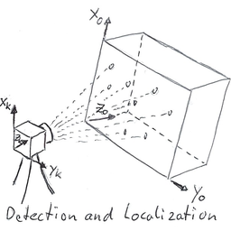

# Various Notebooks
This is my collection of experimental notebooks. Multiple methods of data analysis are tried out. They range from simple standard algorithms to methods from the field of machine learning. There are many libraries that provide implementations of these methods. Some of them are tested in the notebooks. The data is collected by sensors I already have in use.
I want to show how amazing analysis and insights are possible by taking a closer look at the data. As inexpensive sensors become more widely available, the potential and usefulness of analyzing their data will greatly increase.
## 1. Energy

<table>
  <tr>
    <th></th>
    <th></th>
    <th></th>
  </tr>
  <tr>
    <th></th>
  </tr>
</table>

## 2. Photogrammetry

<table>
  <tr>
    <th></th>
  </tr>
</table>

## 3. Sports

<table>
  <tr>
    <th></th>
    <th></th>
  </tr>
</table>

**[Imprint](https://github.com/Sepp28/Impressum)**
