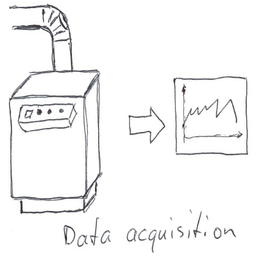
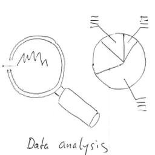
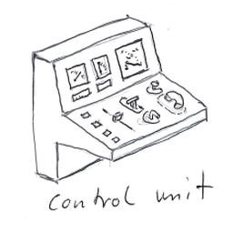
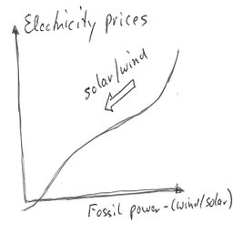
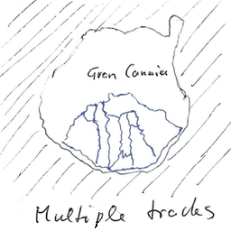
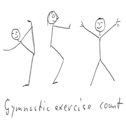

# DiversNotebooks
A collection of different, experimental notebooks about various topics.

## 1. Energy

<table>
  <tr>
    <th></th>
    <th></th>
    <th></th>
  </tr>
  <tr>
    <th></th>
  </tr>
</table>

## 2. Sports

<table>
  <tr>
    <th></th>
    <th></th>
  </tr>
</table>

**[Imprint](https://github.com/Sepp28/Impressum)**
